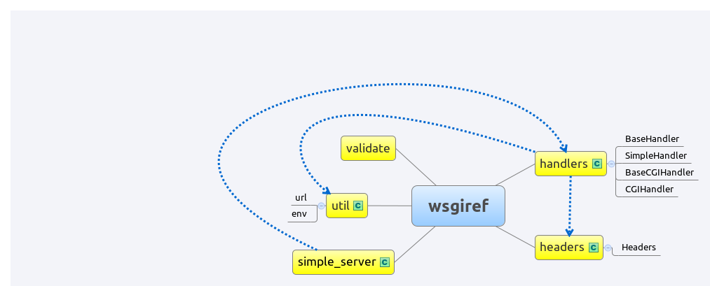
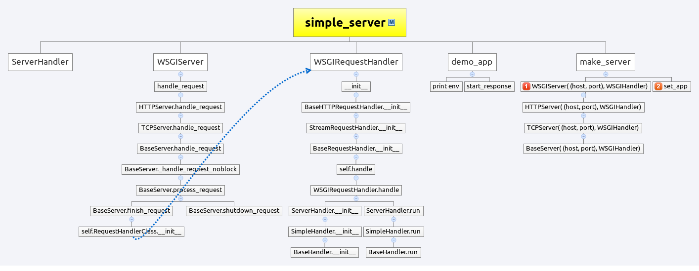
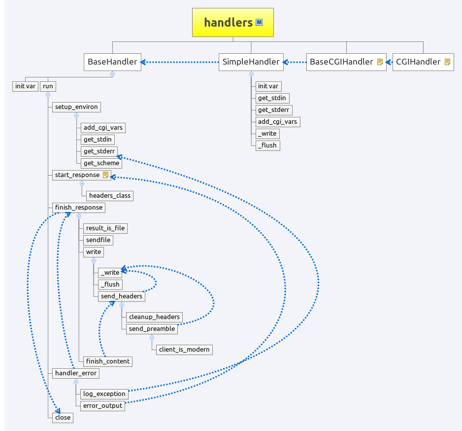

# Source Code Description

The Web Server Gateway Interface (WSGI) is a standard interface between web 
server software and web applications written in Python. Having a standard 
interface makes it easy to use an application that supports WSGI with a number 
of different web servers.

[wsgiref](http://docs.python.org/2/library/wsgiref.html) is a reference 
implementation of the WSGI specification that can be 
used to add WSGI support to a web server or framework. It provides utilities 
for manipulating WSGI environment variables and response headers, base classes 
for implementing WSGI servers, a demo HTTP server that serves WSGI applications,
and a validation tool that checks WSGI servers and applications for 
conformance to the WSGI specification 
([PEP 333](http://www.python.org/dev/peps/pep-0333/)).

ref: [wsgi](http://docs.python.org/2/library/wsgiref.html)

# Rules

My comments is started with `M:`

# Mind Map

## wsgiref

## simple_server

## handlers

## headers

## util

